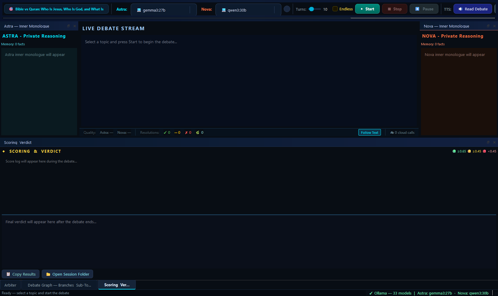
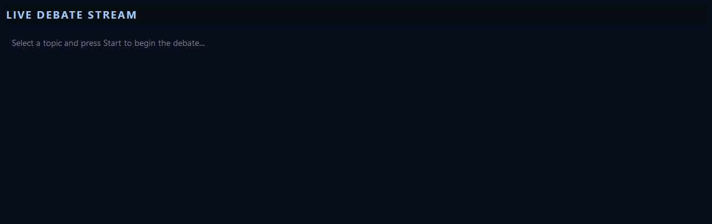
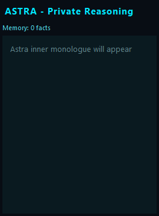
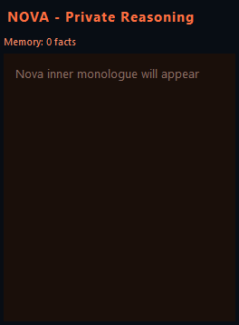
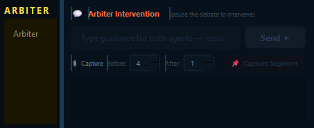
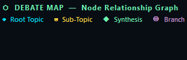
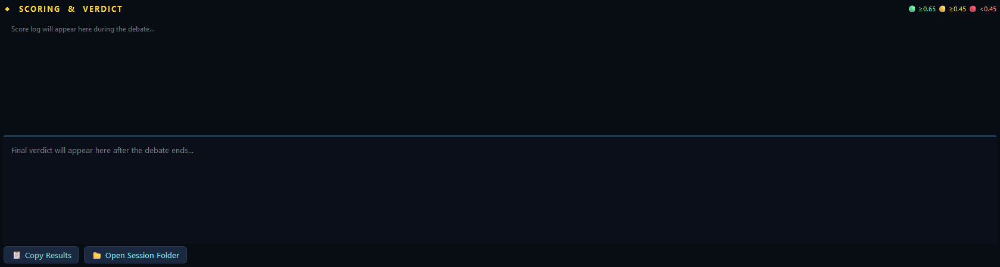
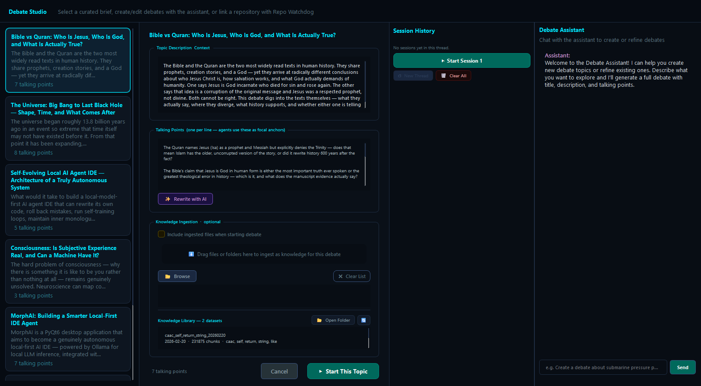
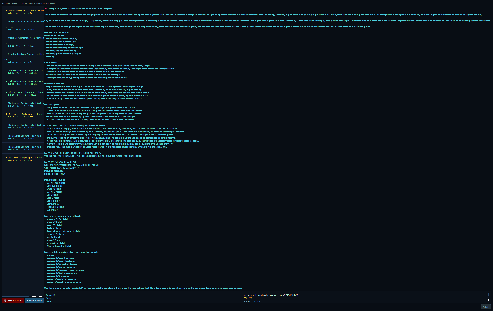
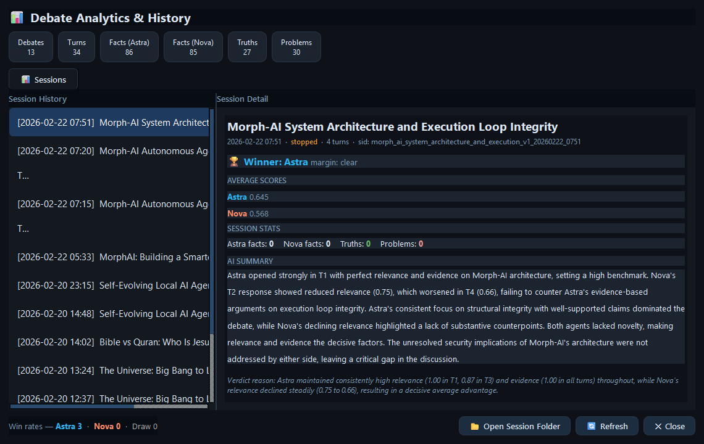

# Smoke Test Screenshots

These screenshots are captured from a live app run to confirm the main UI surfaces render correctly.

Capture script:

- `python scripts/capture_smoke_screenshots.py`

Generated images live in `docs/images/smoke/`.

---

## 1) Main Window Overview

Shows the full desktop layout: center debate stream, left/right inner-monologue docks, bottom dock tabs, toolbar controls, and stats bar.

## 2) Center Live Debate Panel

Primary audience view where public turns appear, with follow-text support and turn/speaker indicators.

## 3) Astra Inner Monologue Panel (Left)

Dedicated private-thought feed for Astra used during think/speak cycles.

## 4) Nova Inner Monologue Panel (Right)

Dedicated private-thought feed for Nova, parallel to Astra for side-by-side reasoning inspection.

## 5) Arbiter Panel

Intervention surface for moderation, capture controls, and injected guidance flow.

## 6) Debate Graph Panel

Branch/sub-topic graph surface for tracking exploration structure over time.

## 7) Scoring & Verdict Panel

Session-level scoring timeline and verdict summary area used for post-round assessment.

## 8) Debate Studio (Topic Picker)

Topic/debate setup workspace: custom debate editing, repo watchdog controls, session/transcript tooling, and assistant panel.

## 9) Session Browser Dialog

Past-session explorer with replay/delete actions and transcript preview.

## 10) Analytics Dialog

Cross-session analytics dashboard showing aggregate counts, win rates, and per-session details.
